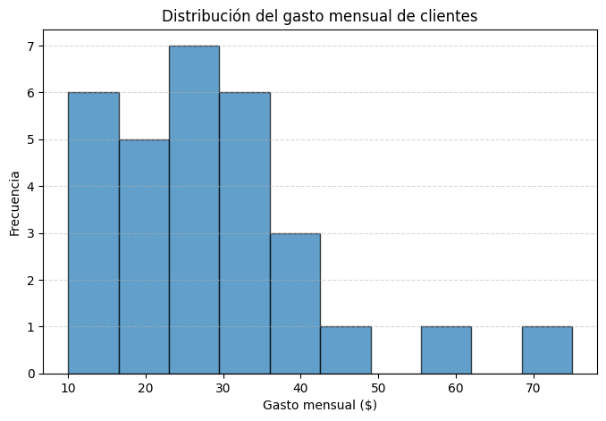
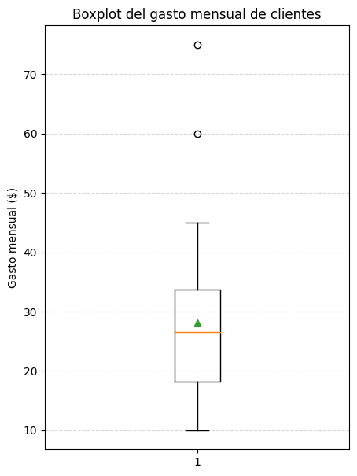
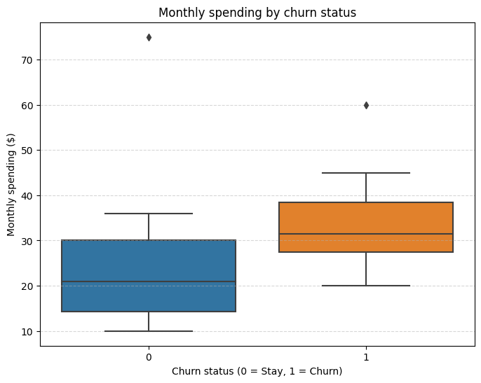
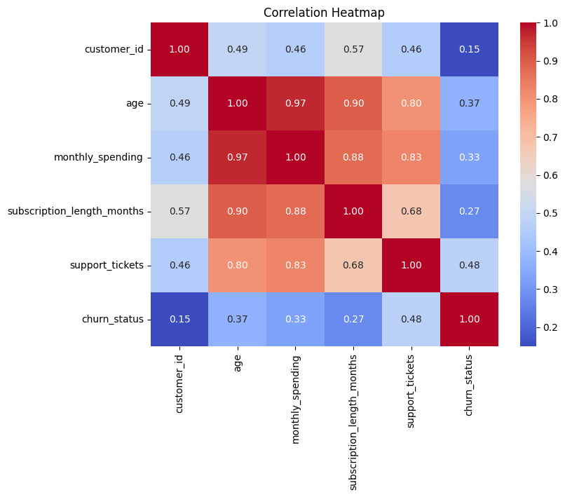

# 📊 Customer Spending Analysis  
**Online Fitness Platform**

## 📌 Project Overview
This project analyzes **monthly customer spending behavior** on an online fitness platform.  
The objective is to understand spending distribution, detect outliers, analyze churn-related behavior, and explore relationships between key numerical variables.

This analysis is designed as a **portfolio project** demonstrating exploratory data analysis (EDA), visualization, and business-oriented insights.

---

## 🏢 Business Context
- **Company:** Online Fitness Platform  
- **Product:** Monthly Subscription  
- **Role:** Junior Data Analyst  

**Business Question:**  
> How do customers spend on average, how variable is their spending, and how does spending relate to churn?

---

## 📂 Dataset
The dataset includes customer-level information such as:
- `monthly_spending`
- `subscription_length_months`
- `support_tickets`
- `churn_status` (0 = Active, 1 = Churn)
- Demographic variables (age, country)

---

## 🔍 Exploratory Data Analysis

### 1️⃣ Distribution of Monthly Spending
The histogram below shows the overall distribution of customer spending.

**Insight:**
- Spending is strictly positive
- The distribution is right-skewed
- Most customers spend a moderate amount, with a few high spenders

---

### 2️⃣ Outlier Detection with Boxplot
The boxplot highlights the variability in customer spending and identifies high-end outliers.

**Insight:**
- High spenders are present
- These values represent real customer behavior, not data errors

---

### 3️⃣ Monthly Spending by Churn Status
This boxplot compares spending between customers who stayed and those who churned.

**Insight:**
- Differences in spending patterns may be related to churn
- This visualization helps identify whether higher or lower spending correlates with customer retention

---

### 4️⃣ Correlation Analysis
A correlation heatmap was created using all numerical variables in the dataset.

**Insight:**
- Helps identify relationships between spending, churn, subscription length, and support tickets
- Useful for feature selection and further predictive modeling

---

## 💡 Key Insights
- Most customers exhibit moderate monthly spending
- A small group of customers contributes disproportionately to revenue
- Spending behavior varies across churn status
- Certain numerical variables show meaningful correlations

---

## 📈 Business Recommendations
- **Segment customers by spending level**
  - Identify and nurture high-value users
- **Analyze churn-driving factors**
  - Combine spending with support and subscription metrics
- **Design targeted retention strategies**
  - Especially for customers showing early churn signals
- **Monitor spending trends over time**
  - Improve lifetime value (LTV) estimation

---

## 🛠️ Tools & Technologies
- Python  
- Pandas  
- Matplotlib  
- Seaborn  
- Jupyter Notebook  

---

## 🚀 Portfolio Value
This project demonstrates:
- Strong exploratory data analysis skills
- Clear and effective data visualization
- Business-driven interpretation of results
- Readiness for an entry-level Data Analyst role

